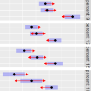

R package **emmeans**: Estimated marginal means 
====
## Website
https://rvlenth.github.io/emmeans/

## Features
Estimated marginal means (EMMs, also known as least-squares means in the
context of traditional regression models) are derived by using a model to make
predictions over a regular grid of predictor combinations (called a *reference
grid*). These predictions may possibly be averaged (typically with equal
weights) over one or more of the predictors. Such marginally-averaged
predictions are useful for describing the results of fitting a model,
particularly in presenting the effects of factors. The **emmeans** package can
easily produce these results, as well as various graphs of them
(interaction-style plots and side-by-side intervals).


  * Estimation and testing of pairwise comparisons of EMMs, and several other
    types of contrasts, are provided.
    
  * In rank-deficient models, the estimability of predictions is checked,
    to avoid outputting results that are not uniquely defined.
    
  * For models where continuous predictors interact with factors, the package's
    `emtrends` function works in terms of a reference grid of predicted slopes of
    trend lines for each factor combination.
    
  * Vignettes are provided on various aspects of EMMs and using the package. 
    See the [CRAN page](https://CRAN.R-project.org/package=emmeans).
    
  * We try to provide flexible (but pretty basic) graphics support for
    the `emmGrid` objects produced by the package. Also, support is provided
    for nested fixed effects.
    
  * Response transformations and link functions are supported via a `type`
    argument in many functions (e.g., `type = "response"` to back-transform
    results to the response scale). Also, a `regrid()` function is provided
    to reconstruct the object on any transformed scale that the user wishes.

  * Two-way support of the `glht` function in the **multcomp** package.
  

## Model support


  * The package incorporates support for many types of models, including 
    standard models fitted using `lm`, `glm`, and relatives, 
    various mixed models, GEEs, survival models, count models,
    ordinal responses, zero-inflated models, and others. Provisions for
    some models include special modes for accessing different types of 
    predictions; for example, with zero-inflated models, one may opt for
    the estimated response including zeros, just the linear predictor, 
    or the zero model.
    For details, see
    [`vignette("models", package = "emmeans")`](https://CRAN.R-project.org/package=emmeans/vignettes/models.html)
    
  * Various Bayesian models (**carBayes**, **MCMCglmm**, **MCMCpack**) are
    supported by way of creating a posterior sample of least-squares means or
    contrasts thereof, which may then be examined using tools such as in the
    **coda** package.
    
  * Package developers are encouraged to incorporate **emmeans** support for
  their models by writing `recover_data` and `emm_basis` methods.
    See [`vignette("extending", package = "emmeans")`](https://CRAN.R-project.org/package=emmeans/vignettes/xtending.html)
    

## Versions and installation


  * **CRAN** The latest CRAN version may be found at [https://CRAN.R-project.org/package=emmeans](https://CRAN.R-project.org/package=emmeans).
    Also at that site, formatted versions of this package's vignettes 
    may be viewed.

  * **GitHub** To install the latest development version from GitHub, 
    install the newest version of the **remotes** 
    package. If you are a Windows user, you should also first download and
      install the latest version of
      [`Rtools`](https://cran.r-project.org/bin/windows/Rtools/).
      Then run
    
```r
remotes::install_github("rvlenth/emmeans", dependencies = TRUE, build_vignettes = TRUE)
```
Omitting the `build_vignettes` argument can save some time if you don't want the vignettes. 
They can always be found [for the latest CRAN version](https://cran.r-project.org/package=emmeans) or 
-- perhaps more up-to-date -- the [emmeans site](https://rvlenth.github.io/emmeans/).

*Note:* 

For the latest release notes on this development version, see the 
[NEWS file](https://github.com/rvlenth/emmeans/blob/master/NEWS.md)

## Rounding
For its summary output, **emmeans** uses an optimal-digits algorithm that rounds
results to about the number of displayed digits that are useful, relative to estimates' 
confidence limits. This avoids cluttering the output, but it is unlike other R
results, which are typically less round. If this is annoying to you, there is an 
option (`opt.digits = FALSE`) that disables the optimal-digits routine. Note that
the values actually stored in `emm_summary` objects and such are *not* rounded.

## "Tidiness" can be dangerous
I see more and more users who are in a terrible hurry to get results. They develop
a "workflow" where they plan-out several steps at once and pipe them
together. That's useful when you don't have to think about what happens in
those steps; but *when you're doing the kinds of post hoc analyses offered by*
**emmeans**, *you should be thinking!*
Most functions in the **emmeans** package yield results that are accompanied by 
annotations such as transformations involved, P-value adjustments
made, the families for those adjustments, etc. If you just pipe the results
into some more code, *you never see those annotations*. 

**Please slow down!** Look at the actual results from each **emmeans** package
function without any post-processing -- None. That way, you'll see the annotated
summaries. Statistics is pretty hard stuff. Don't make it harder by blindfolding
yourself.


## Supersession plan
[Julia Piaskowski](https://github.com/jpiaskowski) is preparing to take over as maintainer.

##### *Note: **emmeans** supersedes the package **lsmeans**. The latter is just a front end for **emmeans**, and in fact, the `lsmeans()` function itself is part of **emmeans**.*


